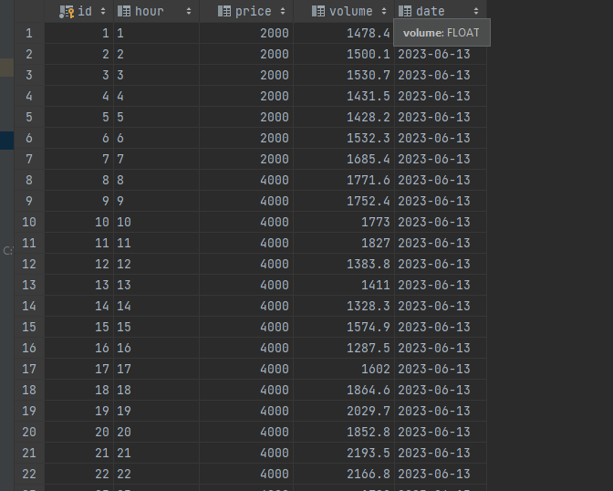
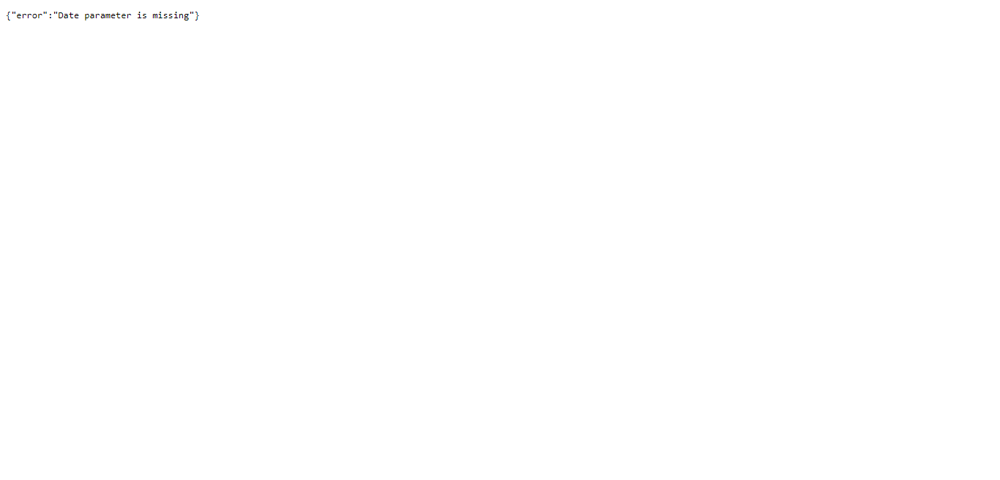
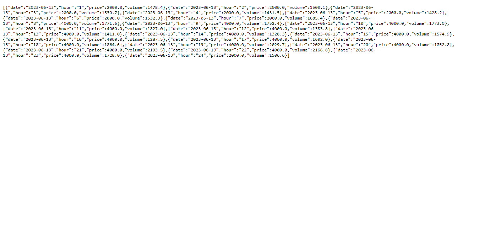
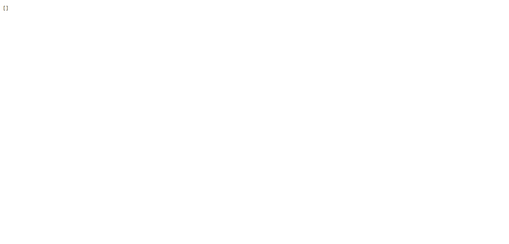

# Market Data Collection and API

This project consists of two scripts: one for collecting market data after the closing of the electricity market for the next day (RDW), and another for creating an API endpoint to retrieve the collected data.

## Requirements

- Python
- Chrome web browser (for data collection script)
- ChromeDriver (for data collection script)
- Flask
- Selenium
- BeautifulSoup
- SQLAlchemy

### Installation

1. Clone the repo
`git clone https://github.com/oksanaaam/service_with_contacts_database.git`
2. Open the project folder in your IDE
3. Open a terminal in the project folder
4. If you are using PyCharm - it may propose you to automatically create venv for your project and install requirements in it, but if not:
```
python -m venv venv
venv\Scripts\activate (on Windows)
source venv/bin/activate (on macOS)
pip install -r requirements.txt
```

## Data Collection Script

The data collection script collects hourly market data after the closing of the electricity market for the next day. It uses Selenium and BeautifulSoup to scrape the data from a web page.

To run the data collection script, follow these steps:
Run the following command:

`python script.py`

The script will open a headless Chrome browser, scrape the data, and store it in a SQLite database (`market_data.db`).


The script will run daily at a specified time (e.g., 12:30 PM) to collect the data for the next day.

## API Endpoint

The API endpoint allows you to retrieve market data for a specific date.

To run the API, follow these steps:

1. Make sure the data collection script is running or has been run at least once to populate the database.

2. Run the following command:

`python app.py`


3. The API will be available at `http://localhost:5000/market_data`.


## Using the API

To retrieve market data for a specific date, make a GET request to the API endpoint with the `date` parameter in the format `YYYY-MM-DD`. 
For example:

GET /market_data?date=2023-06-13

It can be on http://127.0.0.1:5000/market_data?date=2023-06-13


The API will respond with a JSON object containing the market data for the specified date.

If we haven't entry in db for some day, we'll receive empty list


Please note that you may need to update the time in the schedule.every().day.at("18:30").do(run_collect_market_data) line of the models.py script to match the desired time for data collection.

Also, make sure to provide the appropriate URL for the repository in the git clone <repository_url> command.